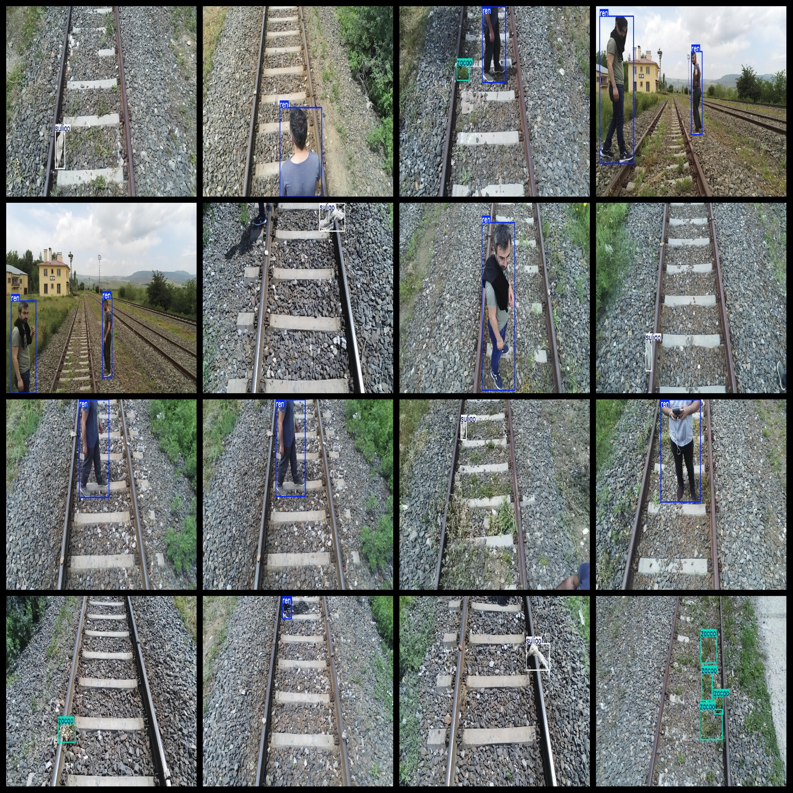

# UAV Aerial Rail Track on Multi-Object Detection Dataset 1100 imagesYOLO-VOC

The UAV aerial rail track multi-object detection dataset consists of 1100 images in the VOC format combined with the YOLO format. The dataset is organized into three folders: JPEGImages, Annotations, and labels, each containing specific file types for image storage, XML files for annotations, and text files for labels.

Inside the JPEGImages folder, there are a total of 1100 JPEG images. The Annotations folder contains 1100 XML files, while the labels folder has 1100 text files. The dataset features 4 categories: Ren (person), Shuzhi (branch), Suliao (plastic), and Zacao (weed). Each category has a set of bounding boxes (boxes) as specified by the classes.txt file in the labels folder.

For the categories Ren, Shuzhi, Suliao, and Zacao, the number of boxes per category is as follows:
- Ren: 843 boxes
- Shuzhi: 31 boxes
- Suliao: 341 boxes
- Zacao: 1039 boxes

Total box numbers across all categories: 2254

The images are of high resolution clarity, with no enhancements applied. The shape of the labels used for target detection is rectangular boxes.

Important Note: No guarantees are made regarding the accuracy or precision of the trained models or weight files. This dataset provides accurate and reasonable annotations only.

Special Note: This dataset does not provide any assurance about the accuracy or precision of the trained models or weight files. It solely provides accurate and reasonable annotations.
## Images

---

Here is a pay link on Stripe (https://buy.stripe.com/3cs8yP7sY87d0vu9AB). Please contact me lonlonago@foxmail.com after funding $89, and I will send you a complete data files, thank you!

